# Reproducing *Diffusion Beats GANs on Image Synthesis*  

## Introduction  
This repository contains my attempt at reproducing the results from the paper *Diffusion Beats GANs on Image Synthesis*. I implemented the guided diffusion model across multiple resolutions (64×64, 128×128, 256×256, 512×512) and evaluated the generated samples. The goal was to assess how closely the reproduced results align with the scores reported in the paper.  

---

## Sample Images  

Below are example samples generated at different resolutions. Five samples from each resolution are shown for visualization.  

### ImageNet 64×64  
  
  
  
  
  

### ImageNet 128×128  
  
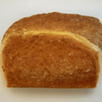  
  
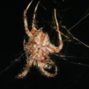  
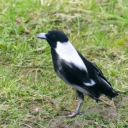  

### ImageNet 256×256  
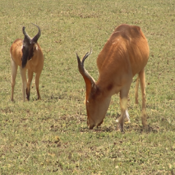  
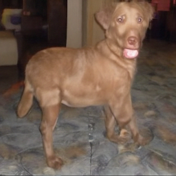  
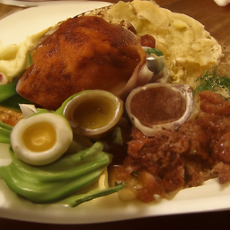  
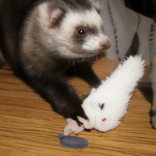  
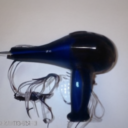  

### ImageNet 512×512  
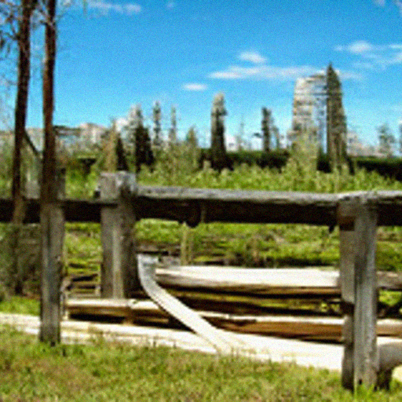  
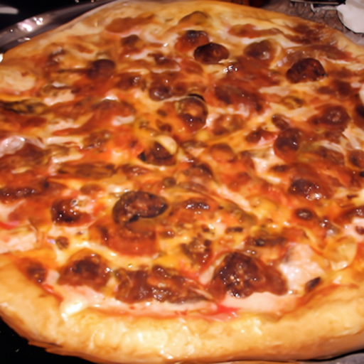  
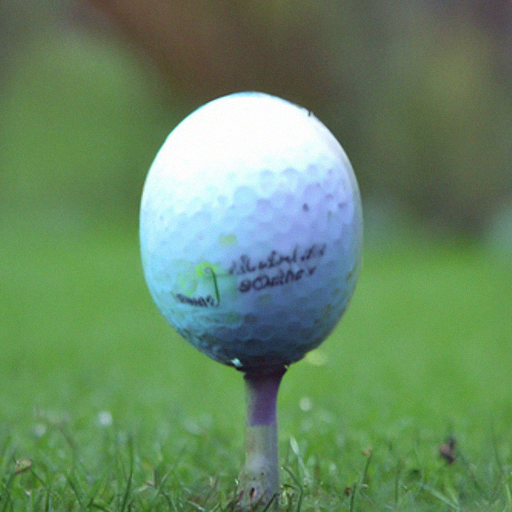  
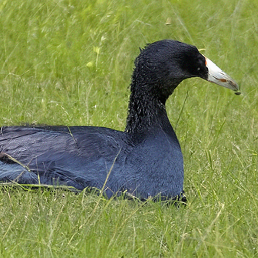  
  

---

## Results Comparison  

### Reported in Paper  
| Dataset          | FID  | Precision | Recall |
|------------------|------|-----------|--------|
| ImageNet 64×64   | 2.07 | 0.74      | 0.63   |
| ImageNet 128×128 | 2.97 | 0.78      | 0.59   |
| ImageNet 256×256 | 4.59 | 0.82      | 0.52   |
| ImageNet 512×512 | 7.72 | 0.87      | 0.42   |

### Reproduced Results  
| Dataset            | IS        | FID   | sFID  | Precision | Recall |
|--------------------|-----------|-------|-------|-----------|--------|
| ImageNet 64×64     | 92.74     | 10.21 | 30.50 | 0.8352    | 0.6364 |
| ImageNet 128×128   | 152.39    | 12.71 | 35.01 | 0.7816    | 0.6757 |
| ImageNet 256×256   | 197.11    | 11.78 | 34.74 | 0.8154    | 0.6698 |
| ImageNet 512×512   | 161.27    | 10.43 | 18.48 | 0.8322    | 0.548  |

---

## Challenges and Limitations  

While reproducing the results, several challenges were encountered:  

- **Compute limitations**: Running large-scale experiments on full ImageNet with sufficient samples was not feasible. The original paper benefits from far greater computational resources, which directly impacts FID and other evaluation scores.  
- **Sample size differences**: Due to compute constraints, evaluation was performed on smaller batches (5,000–13,000 samples) compared to the paper’s full-scale evaluation. This introduces variability in the reported metrics.  
- **Training stability**: Long training runs are sensitive to hyperparameters and infrastructure interruptions, which occasionally led to divergence or incomplete runs.  

As a result, my reproduced results differ from those in the paper. However, the overall trends remain consistent: precision generally increases with higher resolutions, while recall decreases.  
