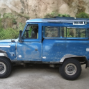
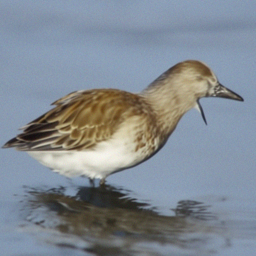

# Reproducing *Diffusion Beats GANs on Image Synthesis*  

## Introduction  
This repository contains my attempt at reproducing the results from the paper [*Diffusion Beats GANs on Image Synthesis*](https://arxiv.org/abs/2105.05233) which introduced improved diffusion architecture and classifier guidance. I implemented the guided diffusion model across multiple resolutions (64×64, 128×128, 256×256, 512×512) and evaluated the generated samples. 

---

## My Approach
Since this paper was very compute expensive I decided to load pretrained weights of both classifiers and ADMs (Ablated Diffusion Models) across different resolutions (64x64,128x128,256x256,512x512). I cloned the official [*OpenAI codebase*](https://github.com/openai/guided-diffusion?tab=readme-ov-file) for the paper and used it fot implementation.Sampling across different resolutions took varied time from 4 to 8 hrs. Due to limited computation different metrics (FID,IS,sFID,Precision and Recall) were calcualted across 5000-13000 generated samples unlike the official implementation which used 50000 samples for evaluation.

---

## Sample Images  

Below are example samples generated at different resolutions. 
 

### 64×64  
| Sample 1 | Sample 2 | Sample 3 | Sample 4 | Sample 5 |
|----------|----------|----------|----------|----------|
|  |  |  |  |  |

### 128×128  
| Sample 1 | Sample 2 | Sample 3 | Sample 4 | Sample 5 |
|----------|----------|----------|----------|----------|
|  |  |  |  |  |

### 256×256  
| Sample 1 | Sample 2 | Sample 3 | Sample 4 | Sample 5 |
|----------|----------|----------|----------|----------|
|  |  |  |  |  |

### 512×512  
| Sample 1 | Sample 2 | Sample 3 | Sample 4 | Sample 5 |
|----------|----------|----------|----------|----------|
|  |  |  |  |  |

---

## Results Comparison  

### Reported in Paper  
| Dataset          | FID  | Precision | Recall |
|------------------|------|-----------|--------|
| ImageNet 64×64   | 2.07 | 0.74      | 0.63   |
| ImageNet 128×128 | 2.97 | 0.78      | 0.59   |
| ImageNet 256×256 | 4.59 | 0.82      | 0.52   |
| ImageNet 512×512 | 7.72 | 0.87      | 0.42   |

### Reproduced Results  
| Dataset            | IS        | FID   | sFID  | Precision | Recall |
|--------------------|-----------|-------|-------|-----------|--------|
| ImageNet 64×64     | 92.74     | 10.21 | 30.50 | 0.8352    | 0.6364 |
| ImageNet 128×128   | 152.39    | 12.71 | 35.01 | 0.7816    | 0.6757 |
| ImageNet 256×256   | 197.11    | 11.78 | 34.74 | 0.8154    | 0.6698 |
| ImageNet 512×512   | 161.27    | 10.43 | 18.48 | 0.8322    | 0.548  |

---

## Challenges and Limitations  

While reproducing the results, several challenges were encountered:  

- **Compute limitations**: Due to limited computation resources available sampling across different resolution took longer time. Also several important experiments and results mentioned in the paper could not be reproduced due to limited compute. 
- **Sample size differences**: Due to limited compute, evaluations were performed on small batches (5000-13000) whereas authors of the paper used 50000 samples for evalutation due to this reproduced results differ from those reported in paper.   

